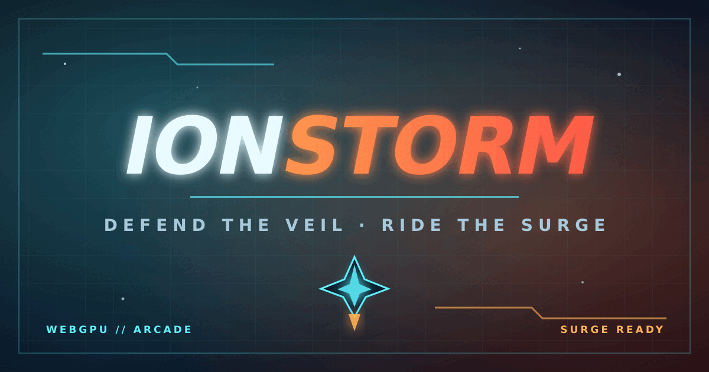

# IONSTORM

**Defend the Veil. Ride the Surge.**

[](https://ionstorm.vercel.app)
[](https://github.com/Faisal01011/IONSTORM/actions/workflows/quality.yml)
[](LICENSE)

IONSTORM is a neon browser arcade shooter built for short, replayable runs. Pilot through escalating enemy waves, break Dreadnought boss encounters, collect scrap, and bring permanent Hangar upgrades into your next deployment.

It uses WebGPU when available and falls back to WebGL2 automatically, so the same game can run across modern desktop and mobile browsers without an account, backend, or installation step.

[](https://ionstorm.vercel.app)

## What is included

- WebGPU rendering with a WebGL2 fallback
- GPU-driven particles, instanced sprites, procedural backgrounds, and screen effects
- Automatic cannons with pointer, keyboard, and touch movement
- Escalating enemy waves, asteroids, power-ups, and Dreadnought bosses
- In-run XP progression with three-choice temporary upgrade drafts
- SURGE overdrive, combo multipliers, achievements, and score chasing
- Three ships with distinct speed, hull, shield, and firing profiles
- Persistent scrap, upgrades, pilot profile, local records, and statistics
- Procedural sound effects and music with accessible mute controls
- Reduced flash, reduced shake, contrast, low-quality, and input-response settings
- A responsive interface for desktop, portrait mobile, and landscape mobile play

## Controls

| Action | Desktop | Mobile |
| --- | --- | --- |
| Move | `WASD`, arrow keys, or pointer | Drag on the game canvas |
| Fire | Automatic cannons | Automatic cannons |
| Activate SURGE | `Space` when charged | Tap the SURGE control or double-tap |
| Launch | `Enter` or `Space` | Tap **LAUNCH MISSION** |
| Pause / resume | `P` | Tap the pause button |
| Toggle sound | `M` | Tap the sound button |
| Open Hangar | `H` | Tap **HANGAR** |
| Relaunch after a run | `R` or `Enter` | Tap **RELAUNCH** |

During a deployment, destroyed enemies grant run XP. Each level-up pauses the
mission and offers three different temporary systems; choose with `1`–`3` on
desktop or tap a card on mobile. These upgrades reset when the run ends.

Visual and performance preferences are saved locally in the browser.
The Hangar's **INPUT RESPONSE** slider tunes touch, pointer, and keyboard steering from 75% (precise) to 175% (fast), with 125% as the default.

## Run locally

IONSTORM is a static site. Node.js is only used for the repository checks; no runtime package installation is required by the game.

```bash
git clone https://github.com/Faisal01011/IONSTORM.git
cd IONSTORM
npm ci
npm run check
npm run serve
```

Open [http://localhost:4173](http://localhost:4173). A local HTTP server is recommended because it reproduces deployed asset and browser behavior more reliably than opening `index.html` directly.

## Browser support

Use a current version of Chrome, Edge, Firefox, or Safari with hardware acceleration enabled. WebGPU is preferred; browsers without a working WebGPU path use the WebGL2 fallback automatically.

If the title screen reports a renderer error, update the browser and graphics drivers, enable hardware acceleration, and reload the page. The renderer shown in the mission panel tells you whether WebGPU or WebGL2 is active.

## Repository layout

```text
IONSTORM/
├── .github/             CI, issue forms, PR template, and code ownership
├── docs/                architecture and development notes
├── src/
│   ├── game.js          renderer, simulation, input, audio, and core progression
│   ├── profile.js       pilot profile, records, and statistics add-on
│   └── styles.css       visual system and responsive interface
├── tests/               Node regression tests and repository contracts
├── index.html           static entry point and game shell
├── og-image.png         generated social preview
├── og-image.svg         editable social preview source
├── CNAME                custom deployment domain configuration
├── package.json         metadata and developer commands
└── LICENSE              MIT license
```

Read the [architecture notes](docs/architecture.md) for the boot sequence, renderer paths, persistence keys, input model, and testing strategy.

## Development

Run the full validation suite before opening a pull request:

```bash
npm run check
```

The check runs JavaScript syntax validation and the built-in Node test suite. GitHub Actions runs the same command for pushes to `main` and pull requests targeting `main`.

For contribution expectations, browser testing guidance, and the project boundaries, see [CONTRIBUTING.md](CONTRIBUTING.md).

## Scope and roadmap

The current records board is intentionally local to the browser; it is not a global leaderboard and is not tamper-proof. There is no account system, matchmaking, or server-side progression.

The next gameplay milestones are:

1. Elite enemies with randomized modifiers
2. Multi-phase Dreadnought encounters
3. Daily seeded challenges with shareable scores
4. Installable PWA support and gamepad input

## License

IONSTORM is released under the [MIT License](LICENSE).
